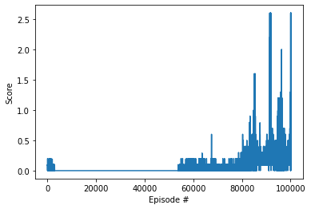
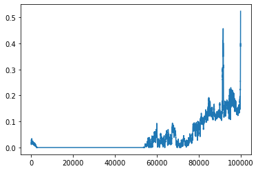

## Report

### Learning Algorithm

This problem takes place in a multi-agent setting with two agents, where each agent takes in a state vector of size 8, and outputs an action vector of size 2. To simplify the problem, we use the meta-agent approach, which treats the problem as a single-agent reinforcement learning problem. With such an approach, we concatenate the state vectors (of size 8) and treat the resultant vector (of size 16) as the input to a single meta-agent. This meta-agent will model the behaviors of both agents, by returning a vector of length 4, which we then split in order to determine the actions of both agents. 

The agent uses the DDPG (Deep Deterministic Policy Gradient) architecture, which is a subset of actor-critic methods. In this architecture, the actor deterministically approximates the optimal policy, mapping states to actions. Meanwhile the critic uses the actor's best believed action to approximate the optimal action value function, thus mapping (state, action) pairs to Q-values. These Q-values are then used to train the actor.

DDPG is intuitively quite similar to DQN (Deep Q-Network) in terms of what it tries to do. Similar to the DQN, it also makes use of a replay buffer and fixed targets; unlike DQN, the targets in DDPG are updated via linear interpolation rather than direct copying.

**Model Architecture**

The actor has an input layer of size 16, corresponding to the size of the post-concatenation state vector. It then has two fully-connected hidden layers of size 128 and 64, respectively. The output layer has a size of 4; the vector obtained from this layer is then split to obtain two vectors of length 2, which determine the agents' behaviors. The two hidden layers of the actor have leaky ReLU activations, while the output layer has a tanh activation to ensure its output is within the expected range of \[-1, 1\].

The critic has an input layer of size 16, corresponding to the size of the post-concatenation state vector. It then has two fully-connected hidden layers of size 128 and 64, respectively. There is another input layer of size 4, corresponding to the size of the pre-split action vector; the inputs of this layer are concatenated with the first hidden layer's outputs before being fed to the second layer. The output layer has a size of 1, corresponding to a scalar Q-value. The two hidden layers have leaky ReLU activations, while the output layer has no activation function.

**Reward Modification**

At each timestep, we modify the reward observed by the agent in order to encourage certain behaviors. This modification occurs internally within the agent itself, and has no impact on the actual scoring of the agent for each episode.

The aforementioned modification works by penalizing the agent with a harsh reward of -10 at the last step of an episode. Intuitively, this encourages the agent to prolong episodes as long as possible, which corresponds to keeping the ball in the air and not letting it hit the ground. Besides helping the agent to avoid the -0.01 score penalty, this also encourages the agent to play each episode out as slowly as possible, thus giving it more chances to hit the ball and accumulate score. 

**Hyperparameters**

| Name           	| Function                                         	| Value 	|
|----------------	|--------------------------------------------------	|-------	|
| BUFFER_SIZE    	| Size of replay buffer                            	| 1e6   	|
| BATCH_SIZE     	| Size of minibatch for training                   	| 128   	|
| GAMMA          	| Discount factor                                  	| 0.99  	|
| TAU            	| Rate of soft update of target network parameters 	| 1e-3  	|
| LR_ACTOR       	| Actor learning rate                              	| 1e-4  	|
| LR_CRITIC      	| Critic learning rate                             	| 1e-3  	|
| LEARN_PERIOD   	| Timesteps between training iterations            	| 1000   	|
| TIMES_TO_LEARN 	| Minibatches per training iteration               	| 11    	|

### Plot of Rewards

The below plot shows how the rewards received by the agent change as the number of episodes increases.

As the performance is quite noisy, this next plot shows a rolling average (taken over 100 episodes) of the same data.

The problem is solved by the **100148th** episode.

### Ideas for Future Work

The code used in this notebook was adapted from the course materials with minor changes. However, if the standard for solving was raised, hyperparameter selection (for both the actor and critic) using a Gaussian process might be a good way to improve performance. Prioritized experience replay, in which the tuples selected for the training minibatches are selected non-uniformly, might also be a good idea. This is because state transitions that involve hitting the ball are likely to be more relevant than other state transitions. Finally, similar to how we modified the agent's perceived reward by penalizing it for letting the ball hit the ground, we could also encourage the agent to perform other beneficial actions, such as moving in the general direction of the ball.
